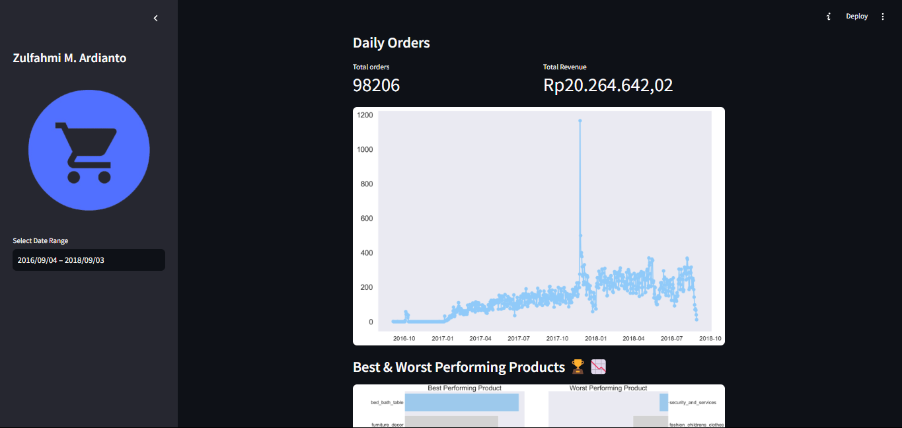

# Submission Dicoding : Belajar Data Analytics dengan Python
# Dashboard E-commerce

## Project Data Analytics

Repository ini berisi proyek data analytics yang saya kerjakan. Deployment in **Streamlit** 
## Deskripsi

Proyek ini bertujuan untuk menganalisis data pada E-Commerce Public Dataset. Tujuan akhirnya adalah untuk menghasilkan insight dan informasi yang berguna dari data yang dianalisis dan divisualisasikan pada laman dashboard

## Struktur Direktori

- **/data**: Direktori ini berisi data yang digunakan dalam proyek, dalam format .csv .
- **/dashboard**: Direktori ini berisi main.py yang digunakan untuk membuat dashboard hasil analisis data.
- **Proyek_Analisis_Data_ECommerce.ipynb**: File ini yang digunakan untuk melakukan analisis data.

## Instalasi

1. Clone repository ini ke komputer lokal Anda menggunakan perintah berikut:

   ```shell
   git clone https://github.com/7z1x/dicoding.git
   ```

2. Pastikan Anda memiliki lingkungan Python yang sesuai dan pustaka-pustaka yang diperlukan. Anda dapat menginstal pustaka-pustaka tersebut dengan menjalankan perintah berikut:

   ```shell
   pip install streamlit
   pip install -r dahsboard/dashboard/requirements.txt
   ```

## Penggunaan

1. Masuk ke direktori proyek (Local):

   ```shell
   cd dashboard/dashboard/dashboard
   streamlit run dashboard/dashboard.py
   ```

   Atau bisa dengan kunjungi website ini [Project Data Analytics](https://dicoding-tjan2lwsgz3l97a447szqk.streamlit.app/)

   </img>
